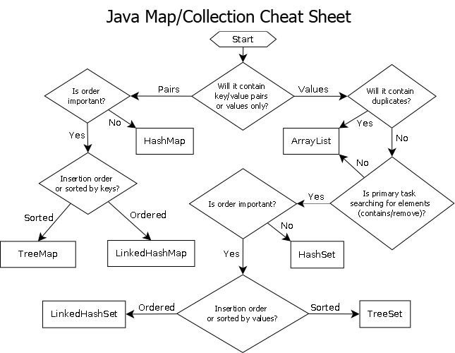

# Advanced Java Programming
LinkedIn Learning
        
        ------- Learning objectives -----------
 - Using generic methods in Java
 - Using wildcards in generic programming
 - Implementing a queue with a LinkedList
 - Functional programming in Java
 - Multi-threading
 - Working with I/O in Java
 - Managing files and directories

## Created with Maven
mvn archetype:generate -DgroupId=com.anna.java.app -DartifactId=advancedJava -DarchetypeArtifactId=maven-archetype-quickstart -DarchetypeVersion=1.4 -DinteractiveMode=false

### Advanced Data Structures

### Security
Substitute plaintext data for the trunk and cryptographic keys for the physical keys from this analogy,
and this is how public key cryptography works. Only the owner of the private key can encrypt data so that the public key decrypts it;
meanwhile, anyone can encrypt data with the public key, but only the owner of the private key can decrypt it.
        
        Therefore, anyone can send data securely to the private key owner. Also, anyone can verify that data they receive 
        from the owner of the private key is actually from that source, and not from an impersonator. 
A website's SSL/TLS certificate (HTTPS), which is shared publicly, contains the public key, 
and the private key is installed on the origin server – it's "owned" by the website.